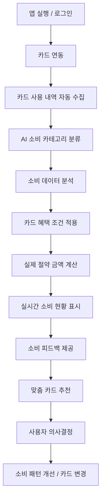

# 뱅크샐러드 카드 추천 서비스 역기획 및 개발

안녕하세요! 핀테크 전공 2학년 학생입니다.
이 프로젝트는 **2026학년도 1학기 [핀테크 서비스 모델링] PBL 과목**에서 진행한 '카드 추천 서비스 역기획 및 개발' 과제 결과물입니다. 평소 자주 사용하는 뱅크샐러드 앱을 분석하고, 사용자가 실질적인 혜택을 얻을 수 있는 새로운 방향으로 서비스를 기획부터 개발까지 직접 진행해보았습니다.

---

## 1. 새로운 서비스 기획: 뱅크샐러드 분석

기존 뱅크샐러드의 기능들을 분석하고 다음과 같은 주요 기능들을 도출했습니다.

- 카드 사용 내역 자동 조회
- 소비 카테고리 분류
- 카드 혜택 분석
- 카드 추천 기능
- 결제 및 소비 리포트

## 2. 새로운 서비스 기획: 세부 기획

위의 분석을 바탕으로, 우리 서비스만의 차별화된 핵심 기능을 세부적으로 기획했습니다.

| 기능명 | 핵심 효과 | 설명 | 해결하는 문제 |
| --- | --- | --- | --- |
| AI 기반 소비 자동 분류 | 개인 맞춤형 가계부 구현 | 사용자 수정 이력을 학습하여 소비 카테고리를 자동으로 정확하게 분류 | 카테고리 분류 오류 |
| 실제 절약 금액 분석 | 실질적인 소비 절약 가능 | 카드 혜택 조건을 반영하여 실제 절약 금액 계산 및 비교 제공 | 혜택 분석의 부정확성 |
| 실시간 소비 반영 | 즉각적인 소비 관리 | 결제 즉시 내역 반영 및 지연 시 예상 소비 표시 | 데이터 반영 지연 |
| 투명한 카드 추천 | 신뢰도 높은 의사결정 지원 | 추천 이유 및 예상 절약 금액을 함께 제공 | 추천 신뢰성 부족 |
| 소비 상태 피드백 | 소비 습관 확인 | 현재 지출 상태에 대한 직관적인 인사이트 메시지 제공 | 단순 기록 기능 한계 |

---

## 3. 비즈니스 모델 캔버스 (BMC) 작성

*누구에게 → 어떤 가치를 → 어떻게 전달해서 → 어떻게 돈을 벌 것인가*에 대한 고민을 담아 기존 서비스와 우리 서비스의 BMC를 비교해 보았습니다.

### 📝 기존 서비스 vs 우리 서비스 BMC 비교표

| 구분 | 기존 서비스 | 우리 서비스 |
| --- | --- | --- |
| **고객 세그먼트** | 일반 소비 관리 사용자 | 절약과 최적화 중심의 사용자로 확대 (20~30대 중심) |
| **가치 제안** | 소비 기록 및 조회 중심 | 실제 절약 금액 분석 등 소비 최적화 및 절약 중심 |
| **소비 분석 방식** | 단순 분류 및 시각화 | AI 기반 개인 맞춤 분석 |
| **카드 혜택 기능** | 단순 정보 제공 수준 | 실제 절약 금액 직접 계산 |
| **데이터 반영** | 지연 발생 가능 | 실시간 + 예측 반영 |
| **개인화 수준** | 제한적 | 사용자 맞춤형 (학습 기반) |
| **추천 시스템** | 불투명 (제휴 중심) | 추천 이유 공개 및 신뢰성 강화 |
| **고객 관계** | 기본 알림 및 리포트 | 맞춤 피드백 및 행동 개선 유도 |
| **수익 구조** | 제휴 중심 | 제휴 수수료 + 프리미엄 구독 모델 |
| **핵심 경쟁력** | 편리한 자동 가계부 | **"돈을 실제로 아껴주는 서비스"** |

---

## 4. 서비스 플로우 차트

앱 실행부터 사용자 맞춤형 카드 추천까지의 전체적인 흐름을 설계했습니다.

---

## 5. UI 설계

직접 설계하고 구현한 화면들입니다.

접속 주소 : http://banksalade-card.kro.kr/

*(아래 이미지는 포트폴리오용으로 추가된 이미지입니다)*
!image.png
!image.png
!image.png
!image.png

---

## 6. KPI 설정 및 전체 핵심 논리

서비스의 성공을 측정하기 위해 다음과 같은 KPI를 설정했습니다.

- **사용량 (MAU 10만, DAU 3만):** 금융/가계부 앱은 초기 진입장벽이 낮지만 주 사용층이 제한적이라는 점을 고려해 현실적인 성장 목표를 잡았습니다.
- **재방문율 (Retention 25~40%):** 금융 앱의 반복 사용성이 높다는 특성을 반영하여, 7일 유지율 40%, 30일 유지율 25%라는 우수한 수준을 목표로 했습니다.
- **핵심 기능 (평균 절약 금액 3만 원, 추천 반영률 20%):** 사용자 입장에서 실제로 체감할 수 있는 절약 금액을 기준으로 삼았습니다.
- **수익성 (프리미엄 전환율 5%, ARPU 2,000원):** 가치가 명확한 금융 서비스의 특성을 고려하여 전환율을 산정했습니다.

### 💡 핵심 논리
도출된 KPI 수치들은 너무 높아서 비현실적이거나 너무 낮아서 경쟁력이 떨어지지 않도록, **실제 서비스 평균 데이터, 금융 앱 특성, 사용자 행동 패턴**을 모두 종합하여 설정한 **'도전적이면서도 현실적인 목표'**입니다.

---

## 5. 핵심 기획 (Why & How) 및 MVP 구현

### 💡 역기획 의도 (Why)
왜 많은 핀테크 서비스 중에서 뱅크샐러드의 '카드 추천'을 선택했을까요?
기존의 카드 추천 서비스들은 대부분 "전월 실적 30만 원 이상 시 혜택"과 같이 복잡한 텍스트 조건과 단순 '최대 한도' 위주로 나열되어 있어, 사용자가 실질적인 혜택을 체감하기 어려웠습니다.
본 프로젝트는 **"내가 평소에 쓰는 대로 쓰면, 이 카드로 정확히 얼마를 아낄 수 있는가?"**라는 질문에 직관적으로 답하기 위해 기획되었습니다.

### 🗄️ 데이터베이스 구조 (ERD)
사용자의 결제(소비) 데이터와 카드가 제공하는 혜택 데이터가 어떻게 매칭되는지 보여주는 핵심 구조입니다.

```mermaid
erDiagram
    USER ||--o{ TRANSACTION : "결제 내역 생성"
    CARD ||--o{ CARD_BENEFIT : "보유 혜택 (할인/적립)"
    USER }|--|| CARD : "추천 매칭"

    USER {
        string id PK
        string name "사용자 이름"
        int totalBudget "월 목표 예산"
    }
    TRANSACTION {
        string id PK
        string userId FK
        string category "소비 카테고리 (식비, 쇼핑 등)"
        int amount "결제 금액"
        date date "결제 일자"
    }
    CARD {
        string id PK
        string name "카드명"
        string company "카드사"
        int annualFee "연회비"
    }
    CARD_BENEFIT {
        string id PK
        string cardId FK
        string category "할인 적용 카테고리"
        float discountRate "할인율/적립률"
        int maxLimit "월 최대 할인 한도"
    }
```

> 💡 **MVP 구현 스펙:** 본 프로젝트는 프론트엔드 중심의 가설 검증용 MVP(최소 기능 제품)입니다. 따라서 무거운 물리적 DB 서버를 구축하는 대신, 위 **ERD 스키마를 TypeScript의 Interface와 Mock Data 객체(`src/data/mock.ts`)로 100% 치환하여 로컬 DB처럼 동작**하도록 구현했습니다. 추후 실제 백엔드 API가 연동되더라도 프론트엔드 로직 수정 없이 데이터만 교체할 수 있도록 확장성을 고려했습니다.

### ⚙️ 핵심 알고리즘 (How)
단순한 화면 카피를 넘어, **'소비 금액별 최대 피킹률(혜택 효율)'**을 계산하는 추천 로직을 코드로 구현했습니다.
1. **소비 데이터 그룹화 (Map-Reduce)**: 사용자의 결제 내역을 카테고리별로 합산.
2. **혜택 매칭 및 한도 적용**: 카드 혜택과 지출 매칭, 최대 할인 한도 보정.
3. **피킹률 산출**: `(예상 총 할인 금액 - 월환산 연회비) / 총 지출액 * 100` 계산.
4. **최적 정렬 (Sorting)**: 최종 절약 금액 기준 내림차순 정렬하여 상위 카드 렌더링.

---
GitHub 레포지토리: https://github.com/dev-jamba05/banksalad-card-recommend-clone
