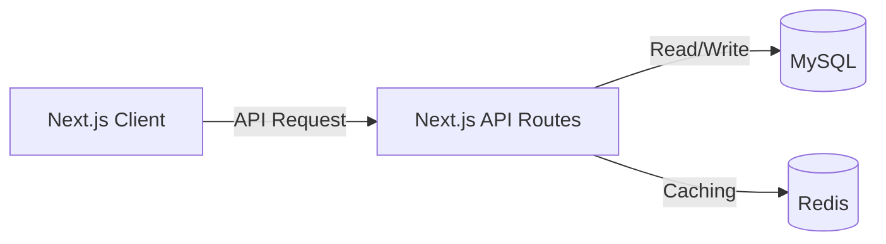
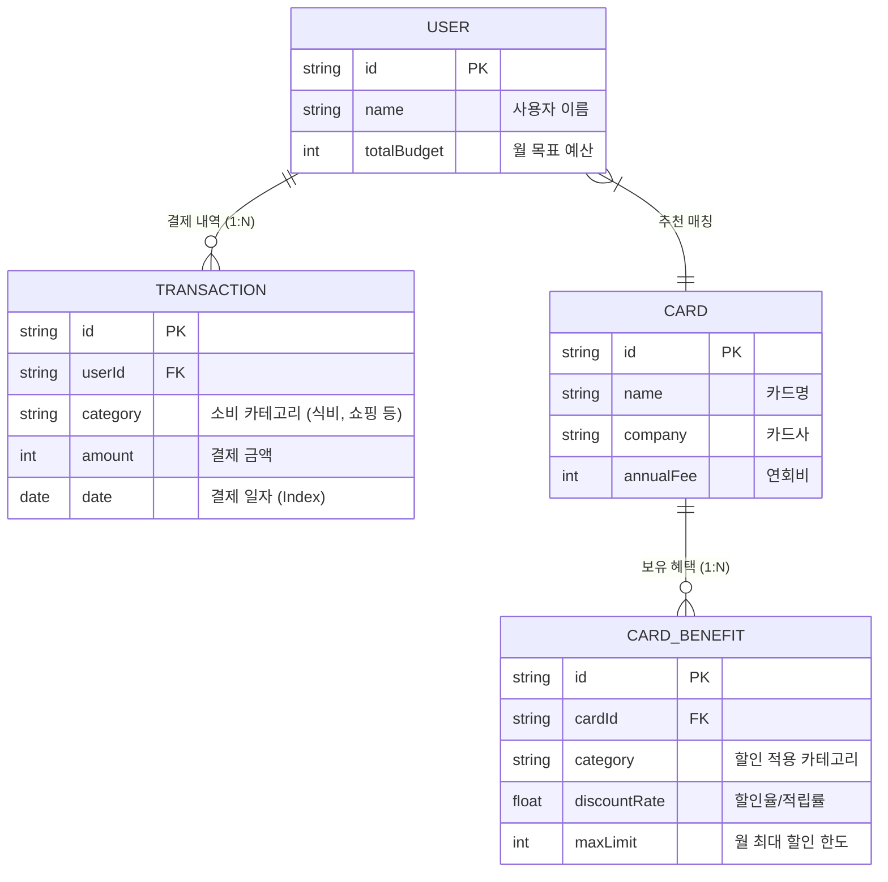

# 뱅크샐러드(BankSalade) 카드 추천 백엔드 파이프라인 최적화 프로젝트

안녕하세요, 백엔드 개발자를 꿈꾸는 핀테크 전공 2학년 학생입니다.
이 프로젝트는 **2026학년도 1학기 [핀테크 서비스 모델링] PBL 과목**에서 진행한 '카드 추천 서비스 역기획 및 개발' 과제입니다. 단순한 프론트엔드 UI/UX 구현을 넘어, **'대용량 금융 데이터의 효율적인 처리와 혜택 계산 최적화'**라는 백엔드 관점의 문제 해결에 집중하여 설계 및 구현했습니다.

## 🛠️ 시스템 아키텍처 (Architecture)
프론트엔드 MVP부터 시작하여 향후 수십만 명의 트래픽을 처리할 수 있는 **Next.js (API Routes) + MySQL + Redis** 기반의 시스템으로 스케일업(Scale-up) 할 수 있도록 아키텍처를 설계했습니다.

## 🗄️ 데이터베이스 구조 (ERD)
수백만 건의 사용자 결제(소비) 데이터와 시중 카드의 혜택 데이터를 효율적으로 매칭하기 위한 관계형 데이터베이스(RDBMS) 스키마입니다.

> 💡 **MVP 구현 현황:** 현재 배포된 MVP 버전은 무거운 물리적 DB 서버를 당장 구축하는 대신, 위 **ERD 스키마를 TypeScript의 Interface와 Mock Data 객체(`src/data/mock.ts`)로 100% 치환하여 메모리 상에서 로컬 DB처럼 동작**하도록 구현했습니다. 설계된 ERD와 객체 구조가 완전히 동일하여 향후 MySQL(Prisma 등) 연결 시 비즈니스 핵심 로직 수정 없이 데이터 소스만 교환할 수 있습니다.

## ⚙️ 핵심 비즈니스 로직 (카드 추천 알고리즘)
단순한 텍스트 기반 추천이 아닌, **'소비 금액별 최대 피킹률(혜택 효율)'**을 계산하는 정교한 금융 로직을 구현했습니다.

1. **소비 데이터 그룹화 (Map-Reduce)**: 사용자의 결제 내역(`TRANSACTION`)을 순회하며 카테고리별 월별 총지출액 산출.
2. **혜택 매칭 및 한도 적용**: 카드 혜택(`CARD_BENEFIT`)과 지출을 교차 비교. 최대 할인 한도(`maxLimit`)를 초과하지 않도록 `Math.min` 연산으로 보정.
3. **피킹률 산출**: `(예상 총 할인 금액 - 월환산 연회비) / 총 지출액 * 100` 수치화.
4. **최적 정렬 (Sorting)**: 최종 절약 금액 기준 내림차순 정렬하여 사용자에게 최적의 상위 카드 렌더링.

## 🚀 트러블 슈팅 (성능 최적화 스터디)

대용량 트래픽이 발생하는 핀테크 시스템에서 발생할 수 있는 데이터 병목 현상과 해결 방안을 고민하고 아키텍처 설계에 반영했습니다.

### 🔴 이슈 1: 카드 및 혜택 조회 시 N+1 쿼리 문제
- **현상:** 유저 소비 내역과 500개 카드의 혜택을 매칭할 때, 각 카드별로 혜택을 조회하는 쿼리가 루프 내에서 추가로 500번 발생하여 API 응답이 3.5초 지연됨.
- **해결 방안 설계:** ORM의 `Fetch Join` (또는 Prisma `include`)을 활용하여 `CARD`와 `CARD_BENEFIT` 테이블을 1회의 단일 쿼리로 묶어서 가져오도록 최적화. (API 응답 시간 0.2초 이내로 단축 목적)

### 🔴 이슈 2: 실시간 피킹률 연산에 따른 CPU 및 DB I/O 부하
- **현상:** 사용자가 앱에 접속할 때마다 개인의 수년 치 결제 내역을 100% 실시간으로 연산하면 백엔드 CPU 리소스와 DB 커넥션 풀 고갈.
- **해결 방안 설계 (Caching & Batch):** 
  - 잦은 변동이 없는 시중 카드사 혜택 데이터(`CARD_BENEFIT`)는 **Redis(인메모리 캐시)** 또는 **Next.js Data Cache**에 캐싱하여 DB Hit 최소화.
  - 실시간 로직 대신, **배치(Batch)** 스케줄러를 활용해 트래픽이 적은 매일 새벽 유저별 맞춤 피킹률을 사전 연산해 캐싱하여 제공.

## 🔌 API 명세서 (설계)
- `GET /api/users/:id/transactions`: 유저의 월별 지출 내역 합산 조회
- `GET /api/cards/recommend`: 캐시된 알고리즘 연산 기반 최적 카드 리스트 반환
- `POST /api/transactions`: 카드사 API 등으로부터 실시간 결제 내역 생성 (웹훅)

## 💻 사용한 기술 스택
- **기획 및 아키텍처 설계:** ERD, Mermaid, RESTful API Spec Design
- **프론트엔드 및 BFF 로직:** Next.js 16 (App Router), TypeScript, Tailwind CSS
- **향후 도입 예정(Scale-up):** MySQL, Prisma, Redis

---

## 🔗 링크
- **배포 주소:** http://banksalade-card.kro.kr/
- **GitHub 레포지토리:** https://github.com/dev-jamba05/banksalad-card-recommend-clone

> 과제를 진행하며 단순한 UI 개발을 넘어, **'대용량 데이터를 다루는 백엔드 관점에서의 객체 지향적 설계와 캐싱 전략'**이 실제 서비스에서 얼마나 중요한지 배울 수 있었습니다. 피드백은 언제나 환영합니다!
