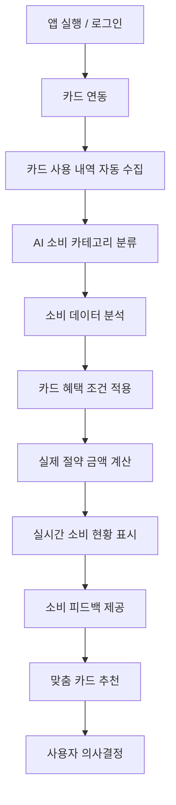

# 뱅크샐러드(BankSalade) 카드 추천 기능 역기획

안녕하세요, 핀테크 전공 2학년 학생입니다.
이 프로젝트는 **2026학년도 1학기 [핀테크 서비스 모델링] PBL 과목**에서 진행한 '카드 추천 서비스 역기획 및 개발' 과제 결과물입니다. 평소 자주 사용하는 뱅크샐러드 앱을 분석하고, 사용자가 실질적인 혜택을 얻을 수 있는 새로운 방향으로 서비스를 기획하고 구현해 본 프로젝트입니다.


## 프로젝트 소개

사용자의 지출 내역을 분석해서 소비 패턴에 맞는 최적의 신용카드를 추천해주는 서비스입니다. 
단순히 카드 혜택을 나열하는 게 아니라, 실제로 내 소비 기준으로 '얼마를 절약할 수 있는지' 보여주는 것에 초점을 맞췄습니다.

## 주요 기능

1. **지출 분석 및 자동 분류**
   - 가짜(Mock) 결제 데이터를 가져와서 카테고리(식비, 교통비 등)별로 얼마나 썼는지 자동으로 분류해서 보여줍니다.
2. **맞춤형 카드 매칭 (실제 절약 금액 분석)**
   - 내 지출 내역을 기준으로, 다른 카드를 썼을 때 연간 얼마를 아낄 수 있는지 계산해서 제일 혜택이 큰 카드를 추천해줍니다.
3. **시각화 UI**
   - 예산 대비 지금 얼마나 썼는지 쉽게 볼 수 있도록 제작했습니다.

## 핵심 기획 내용 (BMC 기반)

기존 서비스들이 단순 가계부 중심이었다면, 본 프로젝트는 **"돈을 실제로 아껴주는 서비스"**라는 명확한 가치 제안(Value Proposition)을 바탕으로 기획되었습니다.

- **타겟:** 절약과 최적화 중심의 20~30대 사용자
- **차별점:** AI 기반 소비 자동 분류, 실제 절약 금액 중심의 투명한 추천 시스템 제공
- **KPI:** MAU 10만, DAU 3만 / Retention 25~40% 등 현실적인 금융 앱 성장 목표 수립

## 서비스 플로우



## 사용한 기술

- **프론트엔드:** Next.js 16 (App Router), React 19
- **스타일링:** Tailwind CSS, CSS Modules
- **언어:** TypeScript

## 실행 방법

로컬에서 돌려보시려면 아래 명령어를 순서대로 입력하시면 됩니다.

```bash
cd banksalade-app
npm install
npm run dev
```

서버가 켜지면 `http://localhost:8080` (또는 설정된 포트)로 접속해서 확인하실 수 있습니다.

---
배포 주소 : http://banksalade-card.kro.kr/
GitHub 레포지토리 : https://github.com/dev-jamba05/banksalad-card-recommend
과제를 진행하며 1인 개발로 처음부터 끝까지 만들어보면서 기획과 개발의 연결고리를 많이 배웠습니다. 피드백 언제나 환영합니다!
