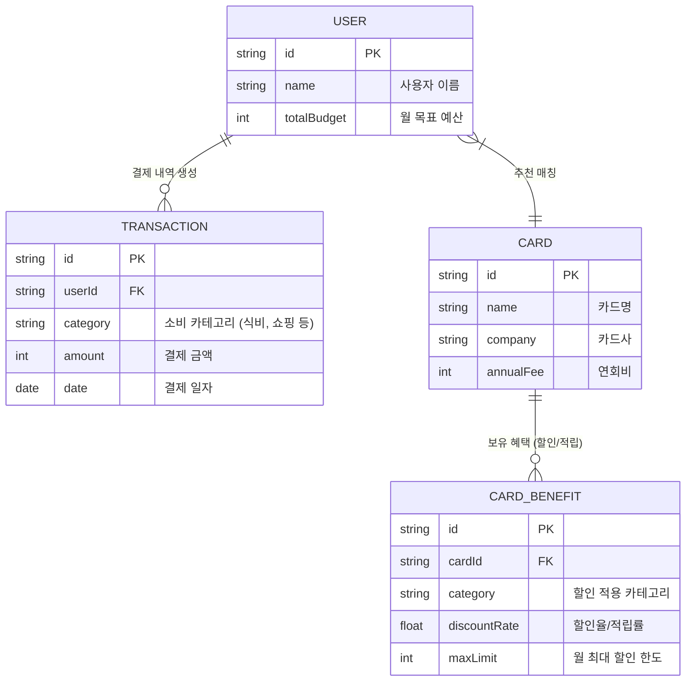
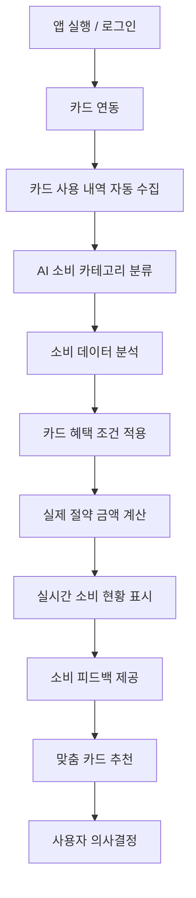

# 뱅크샐러드(BankSalade) 카드 추천 기능 역기획

안녕하세요, 핀테크 전공 2학년 학생입니다.
이 프로젝트는 **2026년 [UI & UX 프로그래밍(HTML)] PBL 과목**의 웹사이트 제작 과제를 위해 개발되었습니다. 기존에 기획했던 뱅크샐러드 카드 추천 서비스(v1)를 바탕으로, **UI & UX 관점에서 사용자 편의성을 극대화하기 위해 한 단계 더 디벨롭(Develop)**한 결과물입니다.

## 프로젝트 소개

사용자의 지출 내역을 분석해서 소비 패턴에 맞는 최적의 신용카드를 추천해주는 서비스입니다.
단순히 카드 혜택을 나열하는 게 아니라, 실제로 내 소비 기준으로 '얼마를 절약할 수 있는지' 보여주는 것에 초점을 맞췄습니다.

## 주요 기능

1. **지출 분석 및 자동 분류**
   - 가짜(Mock) 결제 데이터를 가져와서 카테고리(식비, 교통비 등)별로 얼마나 썼는지 자동으로 분류해서 보여줍니다.
2. **맞춤형 카드 매칭 (실제 절약 금액 분석)**
   - 내 지출 내역을 기준으로, 다른 카드를 썼을 때 연간 얼마를 아낄 수 있는지 계산해서 제일 혜택이 큰 카드를 추천해줍니다.
3. **시각화 UI**
   - 예산 대비 지금 얼마나 썼는지 쉽게 볼 수 있도록 제작했습니다.

## 💡 역기획 의도 (Why)

왜 많은 핀테크 서비스 중에서 뱅크샐러드의 '카드 추천'을 선택했을까요?
기존의 카드 추천 서비스들은 대부분 "전월 실적 30만 원 이상 시 혜택"과 같이 복잡한 텍스트 조건과 단순 '최대 한도' 위주로 나열되어 있어, 사용자가 실질적인 혜택을 체감하기 어려웠습니다.
본 프로젝트는 **"내가 평소에 쓰는 대로 쓰면, 이 카드로 정확히 얼마를 아낄 수 있는가?"**라는 질문에 직관적으로 답하기 위해 기획되었습니다. 사용자가 복잡한 혜택 조건을 직접 계산할 필요 없이, 실제 지출 데이터를 기반으로 **'진짜 절약되는 금액'**을 계산해주는 로직으로 기존의 아쉬운 점을 개선하고자 했습니다.

## 🗄️ 데이터베이스 구조 (ERD)

사용자의 결제(소비) 데이터와 카드가 제공하는 혜택 데이터가 어떻게 매칭되는지 보여주는 핵심 구조입니다.



> 💡 **MVP 구현 스펙:** 본 프로젝트는 프론트엔드 중심의 가설 검증용 MVP(최소 기능 제품)입니다. 따라서 무거운 물리적 DB 서버를 구축하는 대신, 위 **ERD 스키마를 TypeScript의 Interface와 Mock Data 객체(`src/data/mock.ts`)로 100% 치환하여 로컬 DB처럼 동작**하도록 구현했습니다. 추후 실제 백엔드 API가 연동되더라도 프론트엔드 로직 수정 없이 데이터만 교체할 수 있도록 확장성을 고려했습니다.

## ⚙️ 핵심 알고리즘 (How)

단순한 화면 카피를 넘어, **'소비 금액별 최대 피킹률(혜택 효율)'**을 계산하는 추천 로직을 코드로 구현했습니다.

1. **소비 데이터 그룹화 (Map-Reduce)**: 사용자의 전체 결제 내역(`TRANSACTION`)을 카테고리별로 합산하여 월별 총지출액을 산출합니다.
2. **혜택 매칭 및 한도 적용**: 각 카드(`CARD`)의 혜택(`CARD_BENEFIT`) 카테고리와 사용자의 지출 카테고리를 교차 비교합니다. `(카테고리 총 지출액 * 할인율)`을 계산하되, 카드의 `월 최대 할인 한도(maxLimit)`를 초과하지 않도록 보정합니다.
3. **피킹률 산출**: `(예상 총 할인 금액 - 월환산 연회비) / 총 지출액 * 100` 공식을 통해 카드의 실질적인 혜택 효율(피킹률)을 수치화합니다.
4. **최적 정렬 (Sorting)**: 계산된 최종 절약 금액과 피킹률을 기준으로 내림차순 정렬하여, 사용자에게 가장 금전적 이득이 되는 상위 카드를 화면에 렌더링합니다.

## 핵심 기획 내용 (BMC 기반)

기존 서비스들이 단순 가계부 중심이었다면, 본 프로젝트는 **"돈을 실제로 아껴주는 서비스"**라는 명확한 가치 제안(Value Proposition)을 바탕으로 기획되었습니다.

- **타겟:** 절약과 최적화 중심의 20~30대 사용자
- **차별점:** AI 기반 소비 자동 분류, 실제 절약 금액 중심의 투명한 추천 시스템 제공
- **KPI:** MAU 10만, DAU 3만 / Retention 25~40% 등 현실적인 금융 앱 성장 목표 수립

## 서비스 플로우



## 사용한 기술

- **프론트엔드:** Next.js 16 (App Router), React 19
- **스타일링:** Tailwind CSS, CSS Modules
- **언어:** TypeScript

## 실행 방법

로컬에서 돌려보시려면 아래 명령어를 순서대로 입력하시면 됩니다.

```bash
cd banksalade-app
npm install
npm run dev
```

서버가 켜지면 `http://localhost:8080` (또는 설정된 포트)로 접속해서 확인하실 수 있습니다.

---

배포 주소 : http://banksalade-card.kro.kr/

GitHub 레포지토리 : https://github.com/dev-jamba05/banksalad-card-recommend-clone

과제를 진행하며 1인 개발로 처음부터 끝까지 만들어보면서 기획과 개발의 연결고리를 많이 배웠습니다. 피드백 언제나 환영합니다!
